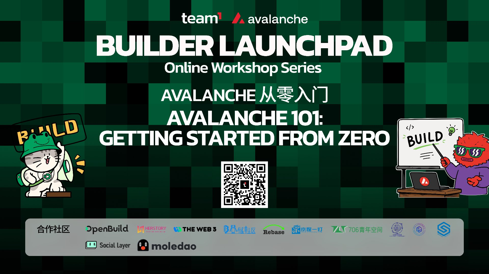

# <训练营名称> Bootcamp

> <一句话定位，例如：由 <主办方> 与 <合作方> 共同发起，从 0 写出你的第一个 Avalanche 应用>

## Introduction

<1-2 段背景介绍，说明为什么要学这个方向，以及本训练营能带来什么。可参考原版写法：先抛出现实痛点，再引出技术方案，最后点明“现在正是入局的好时机”。>

---

### 参与方式

**📅 时间：** <开始日期> - <结束日期>

参与本训练营需要先在 [<报名链接>](<报名地址>) 报名，然后按照以下步骤完成基础信息提交：

1. `Fork` 本仓库，然后 `clone` 到你的本地。
2. 进入 [learn](./learn) 文件夹，创建以你的 GitHub 用户名命名的文件夹 `YourName`。
3. 复制 [Template.md](./Template.md) 文件到刚才创建的文件夹，并将文件重命名为你的名字：`YourName.md`。
4. 打开 `learn/YourName/YourName.md` 文件，根据文档指引填写你的信息并保存。（**<钱包地址/联系方式> 用于发放奖励，请认真填写**）
5. 提交一个 PR 到本仓库，等待合并。| [如何提交 PR？](<PR教程链接>)

---

### ⭐ 课程亮点 ⭐

1️⃣ <亮点一：如导师+助教全程支持，新手友好>

2️⃣ <亮点二：如录播课程+在线答疑，随时开学>

3️⃣ <亮点三：如完成作业有现金/代币奖励，奖金池 ¥XXX>

4️⃣ <亮点四：如直通 Hackathon / 官方生态机会>

---

### 学习准备

完成报名后扫下方二维码加入学习交流群（必须）。课程从最基础的环境搭建开始，用最直接的方式带你理解并动手写出第一个 <技术方向> 应用。**不要求你懂 <前置知识>，跟着做就行。**

#### 谁适合学？

👉 想了解 <技术方向>，但不知道从哪里开始

👉 学过 <语言/框架>，想进入 <新方向>

👉 对 <相关领域> 感兴趣，但一直停留在“听说过”

👉 想做一点真正能跑起来的 <方向> 项目，而不是只看概念

👉 想进入 <生态名> 生态，提前卡位新技术方向

---

### ⭐ 课程大纲 ⭐

**第一章：<章节标题>**（<课时数> 节课）<日期范围> | [课程](<课程链接>) | [task1](./task/task1.md)

- <本章知识点一>
- <本章知识点二>
  - <子知识点>

**第二章：<章节标题>**（<课时数> 节课）<日期范围> | [课程](<课程链接>) | [task2](./task/task2.md)

- <本章知识点>

**第三章：<章节标题>**（<课时数> 节课）<日期范围> | [课程](<课程链接>) | [task3](./task/task3.md)

- <本章知识点>

**第四章：<章节标题>**（<课时数> 节课）<日期范围> | [课程](<课程链接>) | [task4](./task/task4.md)

- <本章知识点>
  - <子知识点>
- 动手在 <测试网/主网> 部署你的第一个合约/应用

---

### 任务

每个课程章节对应一个 **task**，可以在 [task](./task) 文件夹中复制对应章节到你的文件夹 `learn/YourName` 中，然后完成作业并提交 PR。**注意：不要修改别人文件夹的内容。每章课程开课后才可提交本章作业。**

**任何时间都可以提交作业，只是在截止时间之后提交的作业没有奖励。**

| Task | 对应章节 | 学习奖励 | 截止提交时间 | 奖励发放 |
| --- | --- | --- | --- | --- |
| [task1](./task/task1.md) | 1. <章节标题> | <¥XX> | <月日>24:00:00(UTC+8) | [奖励发放记录](./reward/task1_bounty.md) |
| [task2](./task/task2.md) | 2. <章节标题> | <¥XX> | <月日>24:00:00(UTC+8) | [奖励发放记录](./reward/task2_bounty.md) |
| [task3](./task/task3.md) | 3. <章节标题> | <¥XX> | <月日>24:00:00(UTC+8) | [奖励发放记录](./reward/task3_bounty.md) |
| [task4](./task/task4.md) | 4. <章节标题> | <¥XX> | <月日>24:00:00(UTC+8) | [奖励发放记录](./reward/task4_bounty.md) |

完成所有 Task 可直通 <Hackathon 名称>，获得官方深度指导与生态机会。

---

### 关于学习奖励

奖励分为作业奖励和 <寻宝大奖/终极大奖>（奖励池 <XXX>）。

- <终极大奖说明，例如：完成所有课程作业 + 参与黑客松并提交项目，综合评审选取获奖者>
- 作业奖励上面 task 部分已经列出，按时提交作业即可获得作业奖励，如果作业奖励池用完，则晚提交的作业没有奖励

---

### 为什么现在选择 <技术/生态>？

**✅ 技术成熟度拐点**

<说明该技术当前所处的发展阶段、工具链成熟度、开发门槛等>

**✅ 市场需求爆发**

<说明该技术对应的市场需求、合作案例、市场规模预期等>

**✅ 开发者红利期**

<说明生态早期、开发者稀缺、入局可获得的红利等>

---

### 学习资源

#### <技术/生态>

1. [<官方文档名称>](<官方文档链接>)
2. [<语言/框架入门>](<链接>)
3. [<开发工具>](<链接>)

#### <通用方向，如 Web3 / 区块链>

1. [<资源一>](<链接>)
2. [<资源二>](<链接>)

---

### 关于 <主办方>

<主办方介绍，1-2 段，说明其定位、社区理念、专注方向等>

### 关于 <合作方>

<合作方介绍，如适用>
