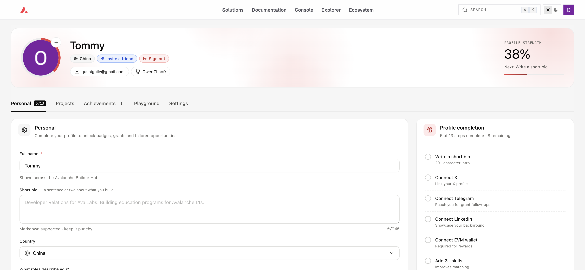
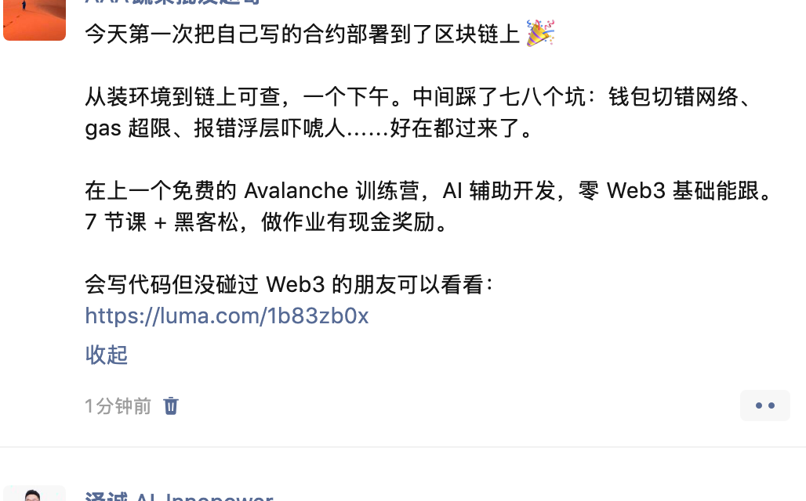

# Task 1：第一章 Avalanche 零基础入门知识

> 对应课程：第一章
> 截止提交：9月6日 24:00:00 (UTC+8)

## 任务目标

### 任务一：注册 BuilderHub 截图

<!--
把截图放进你的文件夹，命名为 task1+你的名字，例如 task1-jiang.png
截图要求：能看到右上角已登录的账号名
参考 /public/作业参考.png
-->

- BuilderHub 地址：https://build.avax.network
- 注册状态：✅ 已完成
- 已完成 Fuji 测试网水龙头领取（C-Chain / P-Chain）

### 任务二：转发课程报名链接截图

<!--
发布后截图，要能看到你的头像 / 发布时间 / 平台标识
命名同上，例如 task1-jiang-share.png
-->

- 转发平台：<小红书 / 推特 / 微信社群 / 朋友圈，填你实际发的>
- 报名链接：https://luma.com/1b83zb0x

## 学习记录

第一章跟下来的实际产出与踩坑，整理如下。

### 完成的事

1. 注册 BuilderHub 并登录 console
2. 在 Testnet Faucet 领取 Fuji 测试币（C-Chain 0.5 AVAX / P-Chain 0.5 AVAX）
3. 浏览 Avalanche 白皮书、Builder Hub、elevate 开发者知识库

### 踩到的坑

| # | 现象 | 实际原因 |
|---|---|---|
| 1 | 水龙头按钮变灰，显示 `Wait 23h 59m` | 不是报错，是已领取成功后的 **24 小时冷却** |
| 2 | 页面提示 `Faucet is only available on testnet`，钱包却弹窗要切到 `Avalanche (C-Chain)` | 弹窗里的是**主网**不是 Fuji，批准无效。要在 console 顶部切 Testnet，或开钱包的 Testnet Mode |
| 3 | 切到主网后余额显示 0，以为币丢了 | 测试币在 Fuji 上，主网余额本来就是 0 |
| 4 | Dexalot 的 `Drip` 点不动，显示 `Faucet: 0.84 ALOT (low)` | `Faucet:` 后面是**水龙头池子余额**不是可领数量，池子只剩 0.84 而单次要发 2，已枯竭 |
| 5 | P-Chain 领不到 | MetaMask 没有 P-Chain 地址（`P-fuji1...` 非 EVM 格式），需要用 Core 钱包或 platform-cli |

### 记下的概念

- **C-Chain / P-Chain 分工**：C-Chain 跑智能合约（EVM 兼容），P-Chain 管验证节点和 L1 创建。新手基本只用 C-Chain。
- **L1（Echo / Dispatch / Dexalot）** 是 Avalanche 生态里的独立链，各有自己的原生 gas 代币，只有在那条链上干活才需要领。
- **测试币没有任何真实价值**，只在测试网可用。
