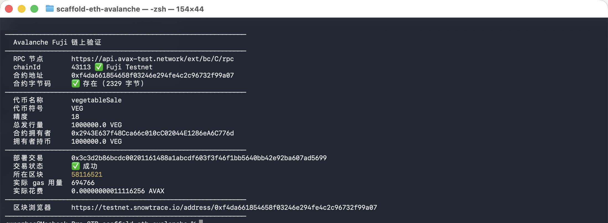
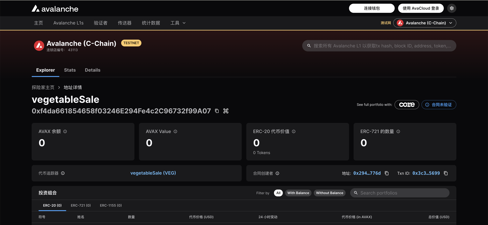

# Task 2：第二章 Vibe Coding 开发你的第一个 DApp

> 对应课程：第二章
> 截止提交：9月6日 24:00:00 (UTC+8)

## 任务目标

掌握 Vibe Coding 技巧，用 Scaffold-ETH 自己部署 ERC20 合约的应用。

## 任务要求

把合约成功部署至 Avalanche 测试网。

---

## 提交内容

### 链上合约地址

| 项目 | 内容 |
| --- | --- |
| 网络 | Avalanche Fuji Testnet (Chain ID `43113`) |
| 合约名称 | VegetableSale |
| 代币名称 | vegetableSale |
| 代币符号 | VEG |
| 精度 | 18 |
| 初始发行量 | 1,000,000 VEG |
| **合约地址** | `0xf4da661854658f03246e294fe4c2c96732f99a07` |
| 部署交易 | `0x3c3d2b86bcdc00201161488a1abcdf603f3f46f1bb5640bb42e92ba607ad5699` |
| 部署账户 | `0x2943E637f48Cca66c010cC02044E1286eA6C776d` |
| 部署区块 | `58116521` |
| 实际 gas 用量 | `694766` |
| 区块浏览器 | https://subnets-test.avax.network/c-chain/address/0xf4da661854658f03246e294fe4c2c96732f99a07 |
| 备用浏览器 | https://testnet.snowtrace.io/address/0xf4da661854658f03246e294fe4c2c96732f99a07 |

### 部署成功截图

<!-- 终端链上验证输出 + Avalanche 官方区块浏览器页面 -->





---

## 实现过程

### 技术栈

Scaffold-ETH 2（`create-eth@2.0.23`）+ Hardhat + OpenZeppelin Contracts v5 + Next.js 16。

### 1. 合约代码

`packages/hardhat/contracts/VegetableSale.sol`：

```solidity
//SPDX-License-Identifier: MIT
pragma solidity >=0.8.0 <0.9.0;

import "@openzeppelin/contracts/token/ERC20/ERC20.sol";
import "@openzeppelin/contracts/access/Ownable.sol";

contract VegetableSale is ERC20, Ownable {
    uint256 public constant INITIAL_SUPPLY = 1_000_000;

    constructor(address initialOwner) ERC20("vegetableSale", "VEG") Ownable(initialOwner) {
        _mint(initialOwner, INITIAL_SUPPLY * 10 ** decimals());
    }

    /// 增发，仅 owner
    function mint(address to, uint256 amount) public onlyOwner {
        _mint(to, amount);
    }

    /// 销毁自己持有的代币
    function burn(uint256 amount) public {
        _burn(msg.sender, amount);
    }
}
```

**为什么继承 OpenZeppelin 而不是手写**：ERC20 只是一套接口标准，规定了 `name` / `symbol` / `totalSupply` / `balanceOf` / `transfer` / `approve` 这些函数的形状。OpenZeppelin 的实现经过多年审计，自己从零手写是新手最容易出安全问题的地方。

### 2. 网络配置

`packages/hardhat/hardhat.config.ts` 增加 Fuji：

```ts
avalancheFuji: {
  type: "http",
  url: "https://api.avax-test.network/ext/bc/C/rpc",
  chainId: 43113,
  accounts: [deployerPrivateKey],
},
```

`packages/nextjs/scaffold.config.ts` 让前端同时支持本地和 Fuji：

```ts
targetNetworks: [chains.hardhat, chains.avalancheFuji],
burnerWalletMode: "allNetworks",
```

### 3. 部署账户

**没有直接用模板自带的默认私钥。** Scaffold-ETH 的 `hardhat.config.ts` 里写死了一个 fallback：

```ts
"0xac0974bec39a17e36ba4a6b4d238ff944bacb478cbed5efcae784d7bf4f2ff80"
```

这是 Hardhat 0 号账户的**公开测试私钥**，印在所有教程里。用它往真实网络部署，合约 owner 就是一个人人都有钥匙的地址，任何人都能调走合约资产。

正确做法是先生成自己的部署账户：

```bash
yarn generate
```

私钥用密码加密后存进 `packages/hardhat/.env` 的 `DEPLOYER_PRIVATE_KEY_ENCRYPTED`，`.env` 已在 `.gitignore` 中，不会进仓库。之后部署到非本地网络时会要求输入密码解密。

### 4. 部署命令

```bash
yarn deploy --network avalancheFuji --tags VegetableSale
```

### 5. 部署输出

```
- Executing packages/hardhat/deploy/01_deploy_vegetable_sale.ts
  - Deploying VegetableSale  with tx:
      0x3c3d2b86bcdc00201161488a1abcdf603f3f46f1bb5640bb42e92ba607ad5699
      (type 0x2, maxFeePerGas: 162, maxPriorityFeePerGas: 150)
    => 0xf4da661854658f03246e294fe4c2c96732f99a07

🪙  ERC20 部署成功
   名称      : vegetableSale
   符号      : VEG
   精度      : 18
   总发行量  : 1000000 VEG
   合约地址  : 0xf4da661854658f03246e294fe4c2c96732f99a07
   拥有者    : 0x2943e637f48cca66c010cc02044e1286ea6c776d
```

### 6. 链上验证

直接通过 Fuji 公共 RPC 读取合约，确认不是本地假象：

```
chainId      : 43113 (Fuji)
合约有字节码 : 是
name         : vegetableSale
symbol       : VEG
decimals     : 18
totalSupply  : 1000000.0 VEG
owner        : 0x2943E637f48Cca66c010cC02044E1286eA6C776d
owner 持币量 : 1000000.0 VEG
交易状态     : 成功（区块 58116521）
实际 gas     : 694766
实际花费     : 0.00000000011116256 AVAX
```

---

## 遇到的问题与解决

| # | 现象 | 原因与解决 |
|---|---|---|
| 1 | `create-eth` 报 `Yarn is not installed` | Node 25 起 corepack 不再内置。`npm install -g yarn` 解决 |
| 2 | 想 `git clone` scaffold-eth-2 仓库 | 那是模板源，正确方式是 `npx create-eth@latest` |
| 3 | 余额有 15 ETH，点 Send 报 `Cannot access account` | `useTransactor` 里 `useWalletClient()` 返回 undefined，页面 stale。硬刷新解决 |
| 4 | 交易成功后红色报错浮层不消失 | Next.js 开发浮层攒的是历史 `console.error`，不代表当前状态。判断成败要看链上数据 |

### 一条通用心法

**读免费，写要付代价。**

界面上的地址、余额、合约状态都走公共 RPC 读取，不需要钱包签字；只有发交易改状态才需要签名并支付 gas。这条同时解释了 gas 机制、为什么第 3 个问题里"看得见钱却花不了钱"，以及 `view` 函数为什么不上链。

---

## 截止时间

9月6日 24:00:00 (UTC+8)
